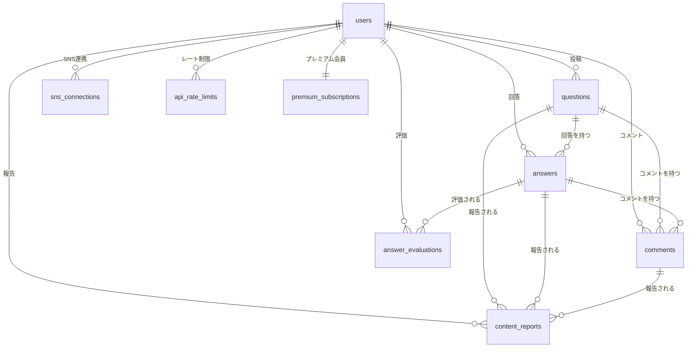

# Data Model: Phase 2 コミュニティ機能

**Date**: 2025-11-04  
**Branch**: `003-community-features`  
**Based on**: [spec.md](./spec.md), [research.md](./research.md)

## Firestore Collections

### 1. `questions` (質問)

**Collection Path**: `/questions/{questionId}`

| Field | Type | Required | Description | Validation |
|-------|------|----------|-------------|------------|
| `questionId` | string | ✅ | ドキュメントID (自動生成) | - |
| `title` | string | ✅ | 質問タイトル | 5~200文字 |
| `body` | string | ✅ | 質問本文 (Markdown対応) | 10~10,000文字 |
| `codeExample` | string | ❌ | コード例 | 0~5,000文字 |
| `authorId` | string | ✅ | 投稿者UID (Firebase Auth) | 有効なユーザーID |
| `authorName` | string | ✅ | 投稿者表示名 (削除時は"削除済みユーザー") | 1~50文字 |
| `authorAvatarUrl` | string | ❌ | 投稿者アイコンURL | 有効なURL |
| `categoryTag` | string | ✅ | カテゴリタグ | 'Flutter', 'Firebase', 'Dart', 'Backend', 'Design', 'Other' |
| `createdAt` | timestamp | ✅ | 投稿日時 | サーバータイムスタンプ |
| `updatedAt` | timestamp | ❌ | 最終更新日時 | サーバータイムスタンプ |
| `answerCount` | number | ✅ | 回答数 | 0以上の整数 |
| `viewCount` | number | ✅ | 閲覧数 | 0以上の整数 |
| `evaluationScore` | number | ✅ | 評価スコア (回答の「役立った」数の合計) | 0以上の整数 |
| `bestAnswerId` | string | ❌ | ベストアンサーID | 存在する回答ID |
| `deletionStatus` | string | ✅ | 削除ステータス | 'normal', 'soft_deleted', 'permanently_deleted' |
| `deletionReason` | string | ❌ | 削除理由 | 'user_request', 'moderation', 'auto_moderation' |
| `scheduledDeletionAt` | timestamp | ❌ | 完全削除予定日時 (ソフト削除から7日後) | - |

**Indexes** (firestore.indexes.json):
```json
[
  { "fields": [
    { "fieldPath": "categoryTag", "order": "ASCENDING" },
    { "fieldPath": "deletionStatus", "order": "ASCENDING" },
    { "fieldPath": "createdAt", "order": "DESCENDING" }
  ]},
  { "fields": [
    { "fieldPath": "categoryTag", "order": "ASCENDING" },
    { "fieldPath": "deletionStatus", "order": "ASCENDING" },
    { "fieldPath": "answerCount", "order": "DESCENDING" }
  ]},
  { "fields": [
    { "fieldPath": "categoryTag", "order": "ASCENDING" },
    { "fieldPath": "deletionStatus", "order": "ASCENDING" },
    { "fieldPath": "evaluationScore", "order": "DESCENDING" }
  ]}
]
```

**State Transitions**:
```
normal → soft_deleted (ユーザー削除 or モデレーション)
soft_deleted → permanently_deleted (7日経過後、Cloud Functions自動処理)
soft_deleted → normal (誤報告時の復元、管理者のみ)
```

---

### 2. `answers` (回答)

**Collection Path**: `/answers/{answerId}`

| Field | Type | Required | Description | Validation |
|-------|------|----------|-------------|------------|
| `answerId` | string | ✅ | ドキュメントID (自動生成) | - |
| `questionId` | string | ✅ | 対象質問ID | 存在する質問ID |
| `body` | string | ✅ | 回答本文 (Markdown対応) | 10~10,000文字 |
| `authorId` | string | ✅ | 回答者UID | 有効なユーザーID |
| `authorName` | string | ✅ | 回答者表示名 | 1~50文字 |
| `authorAvatarUrl` | string | ❌ | 回答者アイコンURL | 有効なURL |
| `createdAt` | timestamp | ✅ | 投稿日時 | サーバータイムスタンプ |
| `updatedAt` | timestamp | ❌ | 最終更新日時 | サーバータイムスタンプ |
| `isBestAnswer` | boolean | ✅ | ベストアンサーフラグ | デフォルト: false |
| `helpfulCount` | number | ✅ | 「役立った」評価数 | 0以上の整数 |
| `notHelpfulCount` | number | ✅ | 「役立たなかった」評価数 | 0以上の整数 |
| `evaluationScore` | number | ✅ | 信頼性スコア (helpfulCount - notHelpfulCount) | 整数 |
| `deletionStatus` | string | ✅ | 削除ステータス | 'normal', 'soft_deleted', 'permanently_deleted' |
| `deletionReason` | string | ❌ | 削除理由 | 'user_request', 'moderation', 'auto_moderation' |
| `scheduledDeletionAt` | timestamp | ❌ | 完全削除予定日時 | - |

**Indexes**:
```json
[
  { "fields": [
    { "fieldPath": "questionId", "order": "ASCENDING" },
    { "fieldPath": "deletionStatus", "order": "ASCENDING" },
    { "fieldPath": "evaluationScore", "order": "DESCENDING" }
  ]},
  { "fields": [
    { "fieldPath": "questionId", "order": "ASCENDING" },
    { "fieldPath": "deletionStatus", "order": "ASCENDING" },
    { "fieldPath": "createdAt", "order": "ASCENDING" }
  ]}
]
```

---

### 3. `comments` (コメント)

**Collection Path**: `/comments/{commentId}`

| Field | Type | Required | Description | Validation |
|-------|------|----------|-------------|------------|
| `commentId` | string | ✅ | ドキュメントID (自動生成) | - |
| `targetType` | string | ✅ | コメント対象種別 | 'question', 'answer' |
| `targetId` | string | ✅ | 対象ID (質問ID or 回答ID) | 存在するID |
| `body` | string | ✅ | コメント本文 | 1~500文字 |
| `templateType` | string | ❌ | テンプレート種別 | 'encouragement', 'helpful', 'question', 'custom' |
| `authorId` | string | ✅ | 投稿者UID | 有効なユーザーID |
| `authorName` | string | ✅ | 投稿者表示名 | 1~50文字 |
| `authorAvatarUrl` | string | ❌ | 投稿者アイコンURL | 有効なURL |
| `createdAt` | timestamp | ✅ | 投稿日時 | サーバータイムスタンプ |
| `deletionStatus` | string | ✅ | 削除ステータス | 'normal', 'soft_deleted', 'permanently_deleted' |
| `deletionReason` | string | ❌ | 削除理由 | - |

**Template Types**:
- `encouragement`: "頑張ってください!", "応援しています!"
- `helpful`: "参考になりました", "ありがとうございます"
- `question`: "詳細を教えてください", "もう少し情報をいただけますか?"
- `custom`: ユーザーがカスタムテキストを入力

---

### 4. `content_reports` (コンテンツ報告)

**Collection Path**: `/content_reports/{reportId}`

| Field | Type | Required | Description | Validation |
|-------|------|----------|-------------|------------|
| `reportId` | string | ✅ | ドキュメントID (自動生成) | - |
| `reporterId` | string | ✅ | 報告者UID | 有効なユーザーID |
| `targetType` | string | ✅ | 報告対象種別 | 'question', 'answer', 'comment' |
| `targetId` | string | ✅ | 報告対象ID | 存在するID |
| `reason` | string | ✅ | 報告理由 | 'spam', 'harassment', 'inappropriate', 'other' |
| `reasonDetail` | string | ❌ | 詳細理由 | 0~500文字 |
| `reportedAt` | timestamp | ✅ | 報告日時 | サーバータイムスタンプ |
| `reviewStatus` | string | ✅ | 審査ステータス | 'pending', 'approved', 'rejected' |
| `reviewedAt` | timestamp | ❌ | 審査日時 | - |
| `reviewerId` | string | ❌ | 審査者UID (管理者) | - |
| `reviewNote` | string | ❌ | 審査メモ | 0~1,000文字 |

**Indexes**:
```json
[
  { "fields": [
    { "fieldPath": "reviewStatus", "order": "ASCENDING" },
    { "fieldPath": "reportedAt", "order": "ASCENDING" }
  ]}
]
```

---

### 5. `hashtag_posts` (ハッシュタグ投稿)

**Collection Path**: `/hashtag_posts/{postId}`

| Field | Type | Required | Description | Validation |
|-------|------|----------|-------------|------------|
| `postId` | string | ✅ | 複合ID: `{provider}_{originalPostId}` | 例: `twitter_1234567890` |
| `provider` | string | ✅ | SNS種別 | 'twitter', 'threads', 'instagram' |
| `originalPostId` | string | ✅ | 元SNSの投稿ID | - |
| `authorName` | string | ✅ | 投稿者名 | 1~100文字 |
| `authorUsername` | string | ✅ | 投稿者ユーザー名 | 1~100文字 |
| `authorAvatarUrl` | string | ❌ | 投稿者アイコンURL | 有効なURL |
| `body` | string | ✅ | 投稿本文 | 1~10,000文字 |
| `mediaUrls` | array | ❌ | 画像・動画URL配列 | 最大4件 |
| `postedAt` | timestamp | ✅ | 元SNSでの投稿日時 | - |
| `fetchedAt` | timestamp | ✅ | アプリ取得日時 (TTL用) | サーバータイムスタンプ |
| `originalUrl` | string | ✅ | 元投稿URL | 有効なURL |
| `likeCount` | number | ❌ | いいね数 | 0以上の整数 |
| `repostCount` | number | ❌ | リポスト数 | 0以上の整数 |

**TTL Policy** (Firestoreルール):
- `fetchedAt`から5分経過で自動削除 (Cloud Functionsで定期クリーンアップ)

**Indexes**:
```json
[
  { "fields": [
    { "fieldPath": "provider", "order": "ASCENDING" },
    { "fieldPath": "postedAt", "order": "DESCENDING" }
  ]},
  { "fields": [
    { "fieldPath": "fetchedAt", "order": "ASCENDING" }
  ]}
]
```

---

### 6. `sns_connections` (SNSアカウント連携)

**Collection Path**: `/sns_connections/{userId}/connections/{provider}`

| Field | Type | Required | Description | Validation |
|-------|------|----------|-------------|------------|
| `userId` | string | ✅ | ユーザーUID | - |
| `provider` | string | ✅ | SNS種別 | 'twitter', 'threads', 'instagram' |
| `accessToken` | string | ✅ | アクセストークン (暗号化) | - |
| `refreshToken` | string | ❌ | リフレッシュトークン (暗号化) | - |
| `expiresAt` | timestamp | ❌ | トークン有効期限 | - |
| `providerUserId` | string | ✅ | SNS側のユーザーID | - |
| `providerUsername` | string | ✅ | SNS側のユーザー名 | - |
| `connectedAt` | timestamp | ✅ | 連携日時 | サーバータイムスタンプ |
| `lastRefreshedAt` | timestamp | ❌ | 最終トークン更新日時 | - |

**Security**:
- アクセストークンは暗号化してFirestoreに保存 (Firebase Secret Managerまたはアプリレベル暗号化)
- Firestoreルールで本人のみ読み取り可能

---

### 7. `api_rate_limits` (APIレート制限)

**Collection Path**: `/api_rate_limits/{userId}_{provider}`

| Field | Type | Required | Description | Validation |
|-------|------|----------|-------------|------------|
| `userId` | string | ✅ | ユーザーUID | - |
| `provider` | string | ✅ | API種別 | 'twitter', 'threads', 'instagram' |
| `windowStart` | timestamp | ✅ | レート制限ウィンドウ開始時刻 | - |
| `requestCount` | number | ✅ | 現在のリクエスト数 | 0~500 |
| `maxRequests` | number | ✅ | 上限リクエスト数 | 500 (デフォルト) |
| `windowDurationMs` | number | ✅ | ウィンドウ期間 (ミリ秒) | 3600000 (1時間) |

**Cleanup Policy**:
- `windowStart`から1時間経過で自動削除またはリセット

---

### 8. `premium_subscriptions` (プレミアムサブスクリプション)

**Collection Path**: `/premium_subscriptions/{userId}`

| Field | Type | Required | Description | Validation |
|-------|------|----------|-------------|------------|
| `userId` | string | ✅ | ユーザーUID | - |
| `planType` | string | ✅ | プラン種別 | 'premium' (月額680円) |
| `platform` | string | ✅ | 購入プラットフォーム | 'ios', 'android' |
| `productId` | string | ✅ | アプリ内課金商品ID | 'premium_monthly_680' |
| `originalTransactionId` | string | ✅ | 元トランザクションID (App Store / Google Play) | - |
| `latestReceiptData` | string | ❌ | 最新レシートデータ (iOS) | - |
| `purchaseToken` | string | ❌ | 購入トークン (Android) | - |
| `startDate` | timestamp | ✅ | サブスク開始日 | - |
| `currentPeriodStart` | timestamp | ✅ | 現在の請求期間開始日 | - |
| `currentPeriodEnd` | timestamp | ✅ | 現在の請求期間終了日 | - |
| `nextRenewalDate` | timestamp | ❌ | 次回更新日 | - |
| `status` | string | ✅ | ステータス | 'active', 'cancelled', 'expired', 'payment_failed_grace' |
| `cancelledAt` | timestamp | ❌ | キャンセル日時 | - |
| `paymentFailedAt` | timestamp | ❌ | 決済失敗日時 | - |
| `gracePeriodEnd` | timestamp | ❌ | 猶予期間終了日時 (決済失敗から7日後) | - |
| `lastDevCoinGrantedAt` | timestamp | ❌ | 最後に月次DevCoinを付与した日時 | - |

**State Transitions**:
```
(購入) → active
active → cancelled (ユーザーがキャンセル、請求期間終了まで有効)
active → payment_failed_grace (決済失敗、7日猶予期間)
payment_failed_grace → active (再決済成功)
payment_failed_grace → expired (7日経過)
cancelled → expired (請求期間終了)
```

---

### 9. `answer_evaluations` (回答評価)

**Collection Path**: `/answer_evaluations/{evaluationId}`

| Field | Type | Required | Description | Validation |
|-------|------|----------|-------------|------------|
| `evaluationId` | string | ✅ | 複合ID: `{userId}_{answerId}` | - |
| `userId` | string | ✅ | 評価者UID | 有効なユーザーID |
| `answerId` | string | ✅ | 回答ID | 存在する回答ID |
| `isHelpful` | boolean | ✅ | 役立った: true, 役立たなかった: false | - |
| `evaluatedAt` | timestamp | ✅ | 評価日時 | サーバータイムスタンプ |

**Constraints**:
- 1ユーザーは1回答に1回のみ評価可能 (複合IDで一意性保証)

---

## Relationships



---

## Data Migration & Seeding

### Phase 1からの引き継ぎ
- `users`コレクションの`devCoinBalance`フィールドを継承
- 既存の`devcoin_transactions`コレクションに回答報酬トランザクションを追加

### Seed Data (開発・テスト用)
```typescript
// Firebase Emulatorで実行
const seedQuestions = [
  {
    title: 'FlutterでFirebase Authenticationのエラーハンドリングのベストプラクティスは?',
    body: 'Firebase Authenticationでサインイン失敗時のエラーを適切にユーザーに表示したいです...',
    categoryTag: 'Flutter',
    authorId: 'test_user_1',
    authorName: 'テスト太郎',
    createdAt: admin.firestore.FieldValue.serverTimestamp(),
    answerCount: 2,
    viewCount: 150,
    evaluationScore: 10,
    deletionStatus: 'normal',
  },
  // ... 他のサンプル質問
];
```

---

## Security Rules

**firestore.rules**:
```javascript
rules_version = '2';
service cloud.firestore {
  match /databases/{database}/documents {
    
    // Questions
    match /questions/{questionId} {
      allow read: if resource.data.deletionStatus == 'normal';
      allow create: if request.auth != null 
        && request.auth.uid == request.resource.data.authorId
        && request.resource.data.deletionStatus == 'normal';
      allow update: if request.auth != null 
        && request.auth.uid == resource.data.authorId
        && !request.resource.data.diff(resource.data).affectedKeys()
          .hasAny(['authorId', 'createdAt', 'deletionStatus']);
      allow delete: if false; // Cloud Functions only
    }
    
    // Answers
    match /answers/{answerId} {
      allow read: if resource.data.deletionStatus == 'normal';
      allow create: if request.auth != null 
        && request.auth.uid == request.resource.data.authorId
        && request.resource.data.deletionStatus == 'normal';
      allow update: if request.auth != null 
        && request.auth.uid == resource.data.authorId
        && !request.resource.data.diff(resource.data).affectedKeys()
          .hasAny(['authorId', 'createdAt', 'isBestAnswer', 'deletionStatus']);
      allow delete: if false; // Cloud Functions only
    }
    
    // Comments
    match /comments/{commentId} {
      allow read: if resource.data.deletionStatus == 'normal';
      allow create: if request.auth != null 
        && request.auth.uid == request.resource.data.authorId;
      allow update: if request.auth != null 
        && request.auth.uid == resource.data.authorId
        && !request.resource.data.diff(resource.data).affectedKeys()
          .hasAny(['authorId', 'createdAt', 'targetType', 'targetId']);
      allow delete: if false;
    }
    
    // Content Reports
    match /content_reports/{reportId} {
      allow read: if request.auth != null 
        && request.auth.uid == resource.data.reporterId;
      allow create: if request.auth != null 
        && request.auth.uid == request.resource.data.reporterId
        && request.resource.data.reviewStatus == 'pending';
      allow update, delete: if false; // Admin/Cloud Functions only
    }
    
    // Hashtag Posts (read-only for clients)
    match /hashtag_posts/{postId} {
      allow read: if request.auth != null;
      allow write: if false; // Cloud Functions only
    }
    
    // SNS Connections (own data only)
    match /sns_connections/{userId}/connections/{provider} {
      allow read, write: if request.auth != null 
        && request.auth.uid == userId;
    }
    
    // Premium Subscriptions (read-only for users)
    match /premium_subscriptions/{userId} {
      allow read: if request.auth != null 
        && request.auth.uid == userId;
      allow write: if false; // Cloud Functions only
    }
    
    // Answer Evaluations
    match /answer_evaluations/{evaluationId} {
      allow read: if request.auth != null;
      allow create: if request.auth != null 
        && evaluationId == request.auth.uid + '_' + request.resource.data.answerId;
      allow update, delete: if false;
    }
  }
}
```

---

## Validation Summary

| Entity | Create | Read | Update | Delete |
|--------|--------|------|--------|--------|
| Question | ✅ Auth + Balance Check | ✅ Public (non-deleted) | ✅ Author only (limited fields) | ❌ Admin only |
| Answer | ✅ Auth | ✅ Public (non-deleted) | ✅ Author only (limited fields) | ❌ Admin only |
| Comment | ✅ Auth | ✅ Public (non-deleted) | ✅ Author only (limited fields) | ❌ Admin only |
| ContentReport | ✅ Auth | ✅ Reporter only | ❌ Admin only | ❌ Admin only |
| HashtagPost | ❌ Functions only | ✅ Auth | ❌ Functions only | ❌ Functions only |
| SNSConnection | ✅ OAuth flow | ✅ Owner only | ✅ Owner only | ✅ Owner only |
| PremiumSubscription | ❌ Functions only | ✅ Owner only | ❌ Functions only | ❌ Functions only |
| AnswerEvaluation | ✅ Auth (1回のみ) | ✅ Auth | ❌ Immutable | ❌ Immutable |

---

## Performance Considerations

- **Pagination**: `startAfterDocument()`を使用した効率的な無限スクロール
- **Cache Strategy**: Firestore Persistence有効化、画像は`cached_network_image`
- **Batch Operations**: 一括削除は`WriteBatch` (最大500件/batch)
- **Denormalization**: `authorName`, `authorAvatarUrl`を質問・回答に重複保存 (表示パフォーマンス優先)

---

## Next Steps (Phase 1 → Phase 2)

1. ✅ データモデル設計完了
2. 🔄 API契約設計 (contracts/ディレクトリ)
3. 🔄 quickstart.md作成 (開発者向けクイックスタートガイド)
4. 🔄 Agent context更新 (Copilot用コンテキストファイル)
